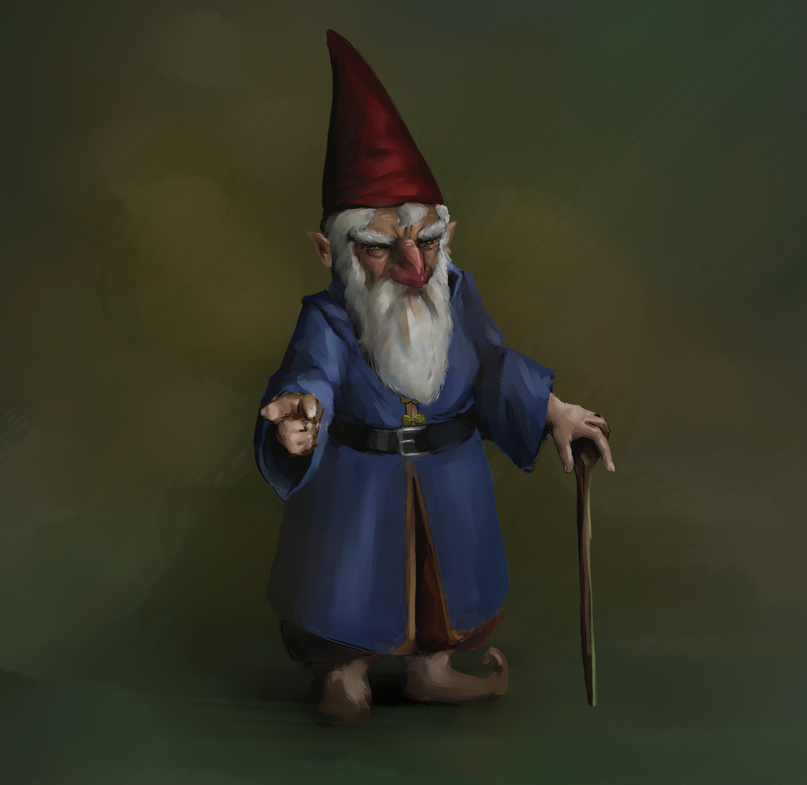
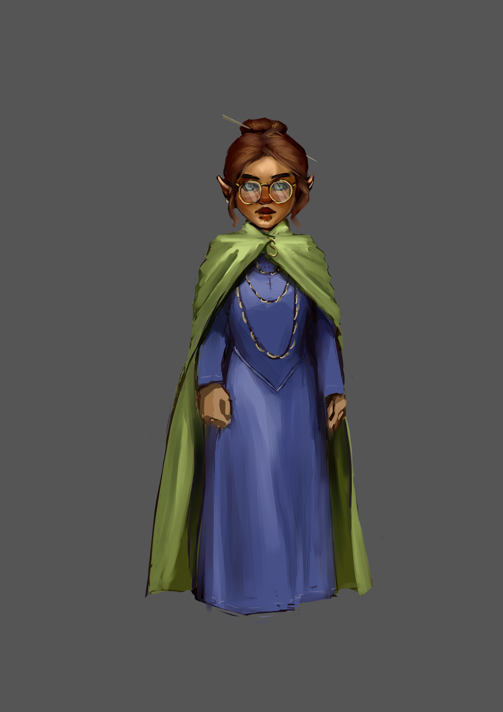
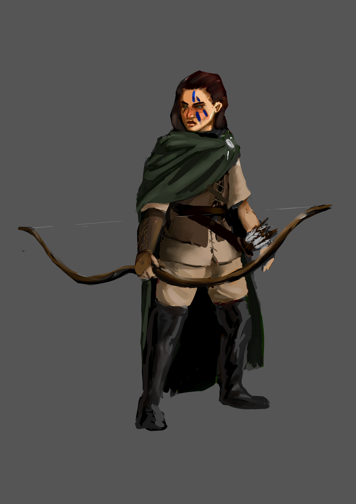
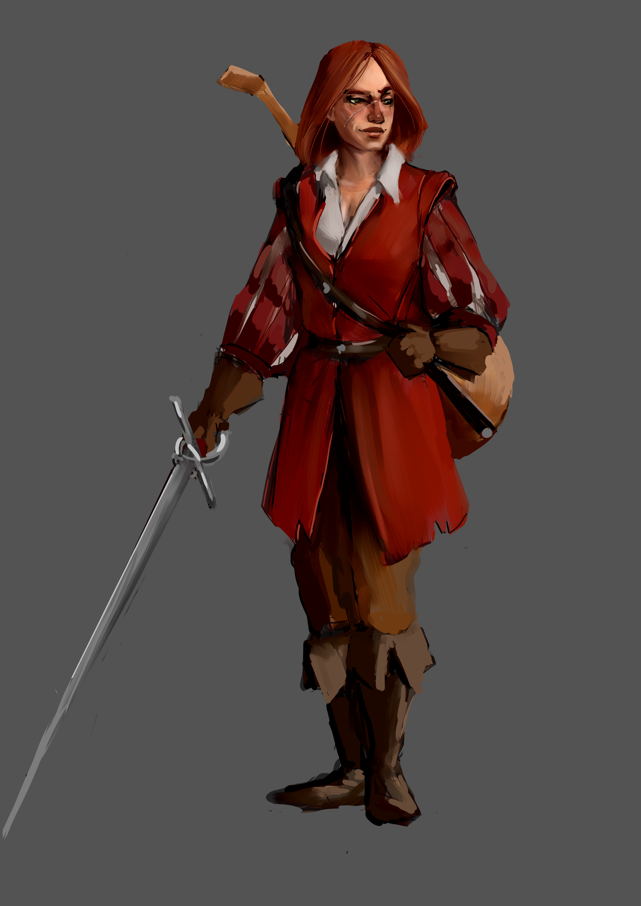

# Dramatis Personae
### Dungeon Master - Josh Wolf

1. [Player Characters](#player-characters)
1. [Followers](#followers)
1. [Armies](#armies)
1. [Supporting Cast](#supporting-cast)

## Player Characters

1. [Fizznob Fizzlebang](#fizznob-fizzlebang---patrick-kelly)
1. [Kramdram Benkam](#kramdram-benkam---heith-kippenhan)
1. [Merrick Brewbottom and Pip the Mastiff](#merrick-brewbottom-and-pip-the-mastiff---tyler-mcgoffin)

### Fizznob Fizzlebang - Patrick Kelly

|   |   |
|---|---|
| Race | Forest Gnome |
| Class | Wizard (Divination) & Cleric (Knowledge) |

[Character Sheet](https://www.dndbeyond.com/characters/59443339)

### Kramdram Benkam - Heith Kippenhan

|   |   |
|---|---|
| Race | Hill Dwarf |
| Class | Rogue (Arcane Trickster) |

[Character Sheet](https://www.dndbeyond.com/characters/66621876)

### Merrick Brewbottom and Pip the Mastiff - Tyler McGoffin

#### **Merrick Brewbottom**
|   |   |
|---|---|
| Race | Stout Halfling |
| Class | Fighter (Cavalier) |

[Character Sheet](https://www.dndbeyond.com/characters/61200966)

#### **Pip (the Mastiff)**
*Merrick's trusty hound and steed*

|   |   |
|---|---|
| Race | Mastiff (Sidekick) |
| Class | Warrior |

[Character Sheet](https://www.dndbeyond.com/monsters/2094891-pip-the-mastiff)

## Followers

1. [Aridira](#aridira)
1. [Gisealia](#gisealia)
1. [Janelle](#janelle)
1. [Tordek](#tordek)

### Aridira

|   |   |
|---|---|
| Patron | Kramdram |
| Type | [Sage (Artisan)](statBlocks/followers/aridiraStatBlock.png) |

### Gisealia

|   |   |
|---|---|
| Patron | Merrick |
| Type | [Tracker (Retainer)](statBlocks/followers/gisealiaStatBlock.png) |

### Janelle

|   |   |
|---|---|
| Patron | Fizznob |
| Type | [Troubadour-warrior (Retainer)](statBlocks/followers/janelleStatBlock.png) |

### Tordek
Not an official follower via MCDM rules, but acting as a retainer for now. His stat block is that of a [guard](https://www.dndbeyond.com/monsters/16915-guard)

## Armies

1. [Connyberran Bulldogs](#connyberran-bulldogs)
1. [Whitemeadow Militia](#whitemeadow-militia-in-training)

### Connyberran Bulldogs
**Sergeants:** Sarah & Damien
|Human Regular Light+ Infantry | Commander: Merrick |
|---|---|
|Attack: +3 | Defense: 12 |
|Power: +2 | Toughness: 12 |
|Morale: +2 | Size: d4 |
|Courageous: Once per battle, succeed on a Morale check it just failed |

*Note: Light+ means +1 Power (reflected in stat block). They have upgraded weapons but not armor*

### Whitemeadow Militia (in training)
**Sergeants:** TBD
|Human Green Light Infantry | Commander: Merrick |
|---|---|
|Attack: +2 | Defense: 12 |
|Power: +1 | Toughness: 11 |
|Morale: +1 | Size: d6 |
|Courageous: Once per battle, succeed on a Morale check it just failed |

## Supporting Cast

1. [Axeholm/Trading Outpost](#axeholmtrading-outpost)
1. [Connyberry](#connyberry)
1. [The Dam](#the-dam)
1. [Dieties, Legends, and Villains](#dieties-legends-and-villains)
1. [The Elvenwood](#the-elvenwood)
1. [Obituary](#obituary)
1. [Whitemeadow](#whitemeadow)

### Axeholm/Trading Outpost

| Name | Relevance | Relations | Description |
| ---- | --------- | --------- | ----------- |
| Bali | Supplies Trader | | Ancient |
| Carberra | Tavernkeeper of the Caravanserai | | |
| Gwarin | Arms Dealer | | Flirtatious. Liked to make Merrick uncomfortable |
| Mordin Coppergrip | Head of the Guard. Recruited by Merrick to serve the Delian Order | Pledged to the Delian Order | |
| Vondel Bronzebeard | Steel Trader | | |
| Vyldara | Banshee of Axeholm. She was an elven ambassador that allegedly conspired against the dwarves. She was arrested and eventually killed along with many dwarves during her attempted jailbreak. Began haunting the place and cleared everyone out. Un-killed in episode 7 | | |

### Connyberry

| Name | Relevance | Relations | Description |
| ---- | --------- | --------- | ----------- |
| Damien | Sergeant of the Connyberran Bulldogs | | |
| Franklin | Fizz swore him to secrecy about his magical exploits? Notes are lacking... | | |
| Sarah | Sergeant of the Connyberran Bulldogs | | |

### The Dam

| Name | Relevance | Relations | Description |
| ---- | --------- | --------- | ----------- |
| Eberk | Keeper of the Delian Order. Bestowed the [Blessing of the Delian Order](https://www.dndbeyond.com/magic-items/4529817-blessing-of-the-delian-order-splint-mail) on Merrick's armor | | |

### Dieties, Legends, and Villains

| Name | Relevance | Relations | Description |
| ---- | --------- | --------- | ----------- |
| Olidammara | God of ??? Appeared to Kramdram while unconscious | | Scary, gangly, and shadowy. Wears a mask that is half black, half white, with a smiling face on the black side and a scowling face on the white side |
| Savras | God of Knowledge. Has appeared to Fizznob on several occasions. | Fizznob's Patron Diety (Knowledge Domain) | Cheerful, enigmatic, and erudite, Savras is a bit out of touch with mortal urgency but seems to mean well |
| Sextus Varius | Founder and hero of the Delian order. He has appeared to Merrick on several occasions. | Champion of the Delian Order and new patron of Merrick. Alleged romantic relations with Tasha | Somber and serious, Sextus carries conviction muted by his regrets |
| Tasha | Maybe the BBEG? Merrick saw her in some visions of Sextus. Found a clone of her in a jar in episode 6 | Alleged romantic relations with Sextus | Bird foot tattoo under her right eye |
| Talos | Evil God of Thunder & Storms. His acolytes were banished from society a long time ago. They used to harry the elves. | Patron God to the Orcish incursion to the Elvenwood | |

### The Elvenwood
| Name | Relevance | Relations | Description |
| ---- | --------- | --------- | ----------- |
| Albion | Elf captain of the band we met in the Elvenwood after killing the Boarc. Quest hook for orc camp and dryad rescue | | Gruff and quick to anger. Fairly prejudiced against dwarves |
| Anchorites of Talos | Orcs invading the Elvenwood | Worship the evil god Talos | Some affinity to thunder and lightning. One of the anchorites was the Boarc we killed in the Elvenwood that managed to cast both Lightning Bolt and Thunderwave before being dispatched |
| Vadania | The half-elf that Kram encountered during his watch in the Elvenwood. Gave some intel about "small lizard creatures" and "dragon flying" to the east. Also portended "the creature you keep in your cloak will be your undoing". No one else is aware this encounter occurred. | | Shapeshifter. She was accompanied by a squirrel (familiar?) |

### Obituary

| Name | Relevance | Cause of Death |
| ---- | --------- | -------------- |
| Dworic | Dwarven companion that recruited us to save the dam (episode 4). Friend of Tordek | Displacer Beast Tentacle on the road between the Wizard Tower and Whitemeadow |

### Whitemeadow

| Name | Relevance | Relations | Description |
| ---- | --------- | --------- | ----------- |
| Bess | Abducted by Goblins in episode 1 | Daughter of Jago | |
| Brecca | serving maiden at the Green Dragon Inn in Whitemeadow | daughter of Giselle and Gowan | Mischievous and adventurous, Brecca is constantly distracted from her duties by dreams of being an adventurer. Merrick has taught her to use a bow, Fizz gave her a magic talking doll and a short sword, and Kram has been encouraging her roguish behavior. We fully intend to turn her into a roguish follower. |
| Elowin | Peasant | Wife of Jago | |
| Gowan | cook at the Green Dragon Inn in Whitemeadow | husband to Giselle; father to Brecca | |
| Giselle | proprietor and barmaid of the Green Dragon Inn in Whitemeadow | wife to Gowan; mother to Brecca | |
| Jack | Miller - attempted to grind gold dust from coin | | | 
| Jago | Blacksmith - runs the only smithy in Whitemeadow. He was the source of the quest hook for episode 1 at the Delian tomb. Later, he asked Merrick to be their liege lord on behalf of the townsfolk to continue to provide protection | Husband of Elowin; father of Bess | An amicable fellow and unofficial leader of Whitemeadow.  |
| Morgous | Carpenter | | |
| Pasco | Traveling Merchant - was stranded in Whitemeadow until we escorted him all the way to the Trading Post outside Irondeep. Has agreed to operate the trade route between Whitemeadow/Connyberry and Axeholm | Father of Talwin | Loving father and gentle man. Interested in helping folks and facilitating trade |
| Ross | Mason | | |
| Talwin | | Daughter of Pasco | Cute young girl who loves to ride Pip |